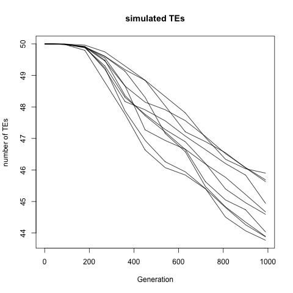
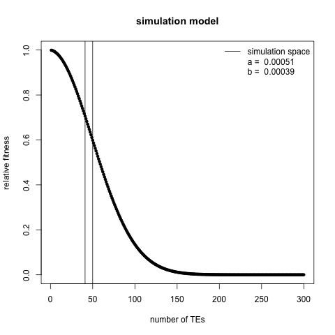

# Yeast TE load prediction

[McDonald et al.](www.nature.com/doifinder/10.1038/nature17143) have produced one of the most exciting experimental datasets for questions about evolution of sex. Sexual and asexual yeast lineages were kept under selection pressure, constant population size, and sequenced every 90 generation in total ~1000 generation experiment. They have evaluated the effect of sex on directional evolution, clearly demonstrating its advantages.

However, there is way more to be done in such system. [Jens' previous work](https://doi.org/10.1093/molbev/msv261) have suggested that asexuality is not causing higher TE loads, which is not conflicting much with theory, that predicts actual decrease in TE load in the absence of sex for sufficiently large populations by [Dolgin and Charlesworth](https://dx.doi.org/10.1534%2Fgenetics.106.060434).

Jens and his colleagues have estimated TE loads of McDonald yeast dataset. They found that levels of TE loads were approximately same in sexual yeast over the experiment, but significantly decreasing in the asexual populations. Huge advantage is that the yeast experiment was in very much controlled environment therefore it should be straightforward to estimate is decline of TE loads in numerically in agreement with the Doligin and Charlesworth's stochastic model.

## Yeast parameters

Yeasts have only LTR transposable elements. Known parameters collected by Jens I can operate with. :

- LTR-LTR recombination frequency (something that deactivate a TE): ~1*10^-6 independent of temperature
- Transposition in 30°C: ~1*10^-6 This might be very crude, it can be in range : 0.7*10^-6 - 10.6*10^-6
- Fitness effect: <2% reduction per single element insertion
- Effective Population size: 100,000
- Generations: 1000

In the empirical data, the asexuals reduce TEs by ca 17.5 (for all) - 23.5% (ca 9 copies lost for full-length TEs (active)) depending on what we look at.

### Simulations

The first draft simulation took naively all the parameters as mentioned above. Selection model is slightly less trivial than the other parameters, therefore it's described in section bellow.

The only obvious discrepancy to real asexual yeast genome is number of chromosomes, I used 2 instead of 16. I left 200 Te slots per chromosome and modeled diploid genome, therefore there is very big margin in terms of genome space.

The modeled decrease is ~6 copies, which is slightly less that what was expected from real data, but it's a great success given how crude the biological estimates of all the parameters might be.

Here is number of TE copies of 10 replicates over 990 simulated generations

This is also expected because the equilibrium prediction of infinite population is also 0, given the parameters used in simulations.

#### Selection model

I used the same function as Dolgin and Charlesworth 2006 (implemented in [get_fitness.R](scripts/get_fitness.R), the function uses two parameters that correspond to decrease of fitness due to individual TE insertions and multiplicative effect given number of TEs present already in genome (epistasis). These parameters were selected so they show ~2% fitness decrease between 50 and 51 TE copies, a standard yeast TE copy number that was used in the experiment for estimation of fitness effects in yeast. Evaluation is in script [calculate_sa_and_sb.R](scripts/calculate_sa_and_sb.R) and the resulting fitness function is shown in following figure, where expected simulation space is marked with vertical lines.

#### Adaptive evolution of transposition rates

I have implemented a mutation model for transposable rates. Every single transposon has it's own initial transposable rate (defined as parameter u) and every transposition leads to "mutation" of transposon that will affect transposition rate by a multiplicative coefficient from normal distribution `m_u ~ N(1,sd)`, where `sd` is an constant hardcoded in file [Genome.cpp](src/Genome.cpp).

Simulations 019 and 020 were supposed to explore what are meaningful `sd` but I can not find any evolution of `sd` in any direction. This will require some mode thinking.

## TODO

- (done) ~first draft asexual simulation~
- (done) ~16 chromosome simulaiton~ (expected to be same for asex : It is)
- (done) ~turn model into haploid!~ (asex haplid == asex haplod - as expected)
- (done) ~allow sexual simulation (need some code modification to have 89 asex, 1 sex  generations)~
- (done) adjust parameters so the number of TEs will remain same over 1000 generations
- (done) use the same parameters in purely asexual simulation as in the first bullet point
- (done) ?? add adeptive TEs
- (done) add intput anf output of sims to this repository

- Check consistency of D&CH equilibrium prediction with my sims
   - my equilibrium sims are predicted to be converge to 0
   - I should try to take predicted equilibrium (for instance Neq = 50, u=10^-6, v=10^-5, a = 0.01, b=2.828*10^-6) and sim it, either it will drift around equil (good) or go somewhere (bad). If (bad) -> Try the same with original D&Ch sim.
   - check consistency with reality - D&CH model can not explain lab measured variables. Is it problem of model or measured variables? Could different parameterization of selection model lead to more consistent results?
- adaptive transposable rates
   - make a switch for adaptive transposable rates (allow this to be turned off)
   - reevaluate what `sd` is reasonable.
   - simulate everything needed
- record reference and non-reference position of TEs separately (mean TEs, mean ref TEs)
- (utopia) adjust model to fit reality

## Notes :

Jens have sent me more models that might be considered.
