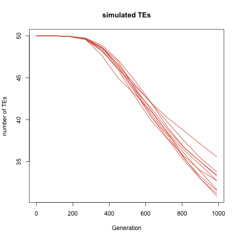

# Yeast TE load prediction

[McDonald et al.](www.nature.com/doifinder/10.1038/nature17143) have produced one of the most exciting experimental datasets for questions about evolution of sex. Sexual and asexual yeast lineages were kept under selection pressure, constant population size, and sequenced every 90 generation in total ~1000 generation experiment. They have evaluated the effect of sex on directional evolution, clearly demonstrating its advantages.

However, there is way more to be done in such system. [Jens' previous work](https://doi.org/10.1093/molbev/msv261) have suggested that asexuality is not causing higher TE loads, which is not conflicting much with theory, that predicts actual decrease in TE load in the absence of sex for sufficiently large populations by [Dolgin and Charlesworth](https://dx.doi.org/10.1534%2Fgenetics.106.060434).

Jens and his colleagues have estimated TE loads of McDonald yeast dataset. They found that levels of TE loads were approximately same in sexual yeast over the experiment, but significantly decreasing in the asexual populations. Huge advantage is that the yeast experiment was in very much controlled environment therefore it should be straightforward to estimate is decline of TE loads in numerically in agreement with the Doligin and Charlesworth's stochastic model.

## Yeast parameters

Yeasts have only LTR transposable elements. Known parameters collected by Jens I can operate with. :

- LTR-LTR recombination frequency (something that deactivate a TE): ~1*10^-6 independent of temperature
- Transposition in 30°C: ~1*10^-6 This might be very crude, it can be in range : 0.7*10^-6 - 10.6*10^-6
- Fitness effect: <2% reduction per single element insertion
- Effective Population size: 100,000
- Generations: 1000

In the empirical data, the asexuals reduce TEs by ca 17.5 (for all) - 23.5% (ca 9 copies lost for full-length TEs (active)) depending on what we look at.

### Simulations

The first draft simulation took naively all the parameters as mentioned above ([simulation 004](sims/old_transposition_model/004_basic_asex). Selection model is slightly less trivial than the other parameters, therefore it's described in section bellow.

The only obvious discrepancy to real asexual yeast genome is number of chromosomes, I used 2 instead of 16. I left 200 Te slots per chromosome and modeled diploid genome, therefore there is very big margin in terms of genome space.

The modeled decrease is ~6 copies, which is slightly less that what was expected from real data, but it's a great success given how crude the biological estimates of all the parameters might be.

Here is number of TE copies of 10 replicates over 990 simulated generations

However, such model is dependent only wish selection since the transposition rate is the same as excision rate. That is confirmed also by a simulation with sex every 90 generations ([simulation 003](sims/old_transposition_model/003_basic_asex), because in that simulation loss of transposable elements is much faster

Either the model is too simple to capture reality, or the parameters derived from the lab are unrealistic. We expect to find out conditions for which sexual won't lose any TEs over the 990 generations (equilibrium simulation). We were performed a set of simulation where we were incrementally increasing transposition rate (simulations sims/005 - 012). Eventually we found a transposition rate (`u = 0.004`) that generates a simulation where number of TEs oscillates around equilibria ([simulation 013](sims/old_transposition_model/013_sex_equil)). We use the same parameters for a simulation without sexual reproduction every 90 generations ([simulation 015](sims/015_seq_equil_asex_sim)). Unlike sexual simulation, asexuals were accumulating TEs

, suggesting that the model is unlikely sufficiently complex to capture reality of transposable elements.

There are two things to try further :
- a model of adaptive transposition rates, if there will be a variation in transposition rates, are they going to evolve differently in different reproduction modes? This is implemented, but not tested. It will require a bit of thinking.
- capture bias of TE assessment. We are way better in presence absence calls of known reference sites of TEs. Maybe the main difference between sexuals and asexuals is not abundance of TEs but their turnover. For this we need to implement change reported summary.

## Details and thoughts

#### Selection model

I used the same function as Dolgin and Charlesworth 2006 (implemented in [get_fitness.R](scripts/get_fitness.R), the function uses two parameters that correspond to decrease of fitness due to individual TE insertions and multiplicative effect given number of TEs present already in genome (epistasis). These parameters were selected so they show ~2% fitness decrease between 50 and 51 TE copies, a standard yeast TE copy number that was used in the experiment for estimation of fitness effects in yeast. Evaluation is in script [calculate_sa_and_sb.R](scripts/calculate_sa_and_sb.R) and the resulting fitness function is shown in following figure, where expected simulation space is marked with vertical lines.

#### Transposition model

We implemented transposition during reproduction phase. In asexual it's equivalent of simple transposition after selection, but during sexual reproduction, transposition happens in diploid gamete phase, thus jumps of TEs between backgrounds is possible. Excision is process during somatic phase in haploid individuals.
